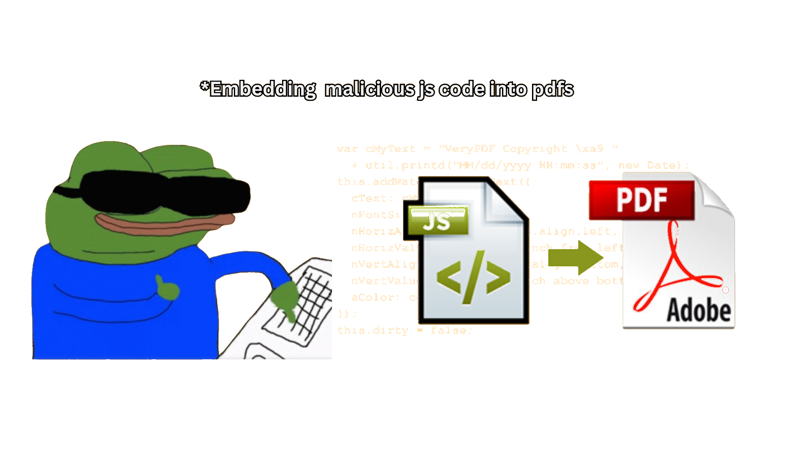
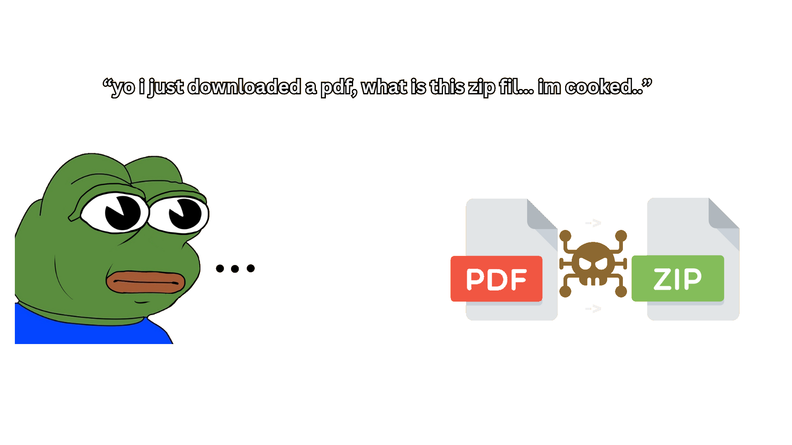
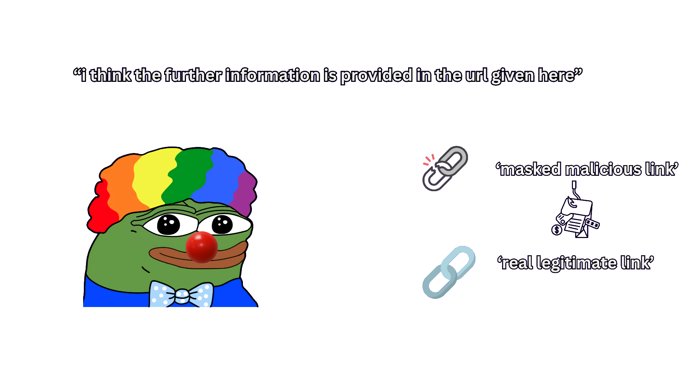
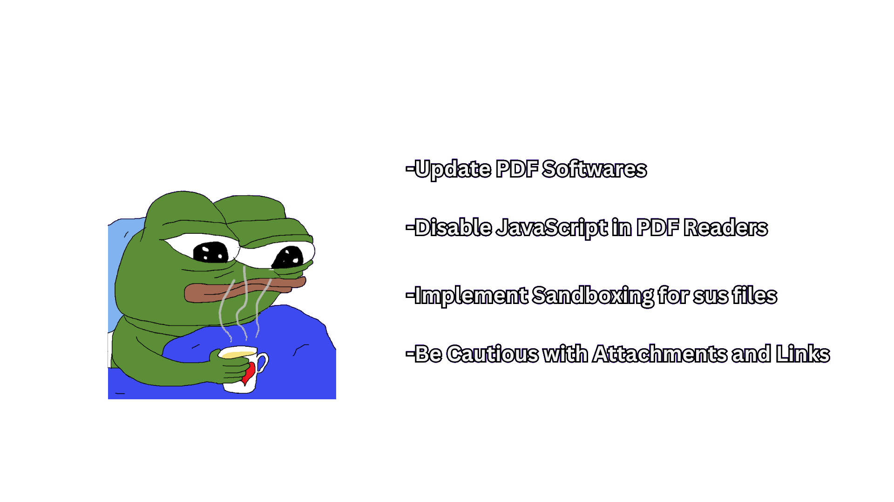

 
<h3>Hacking with PDFs?</h3>  Well, it may sound crazy but hackers do have few different tricks up their sleeves to sneak viruses or malicious code into PDF files. While PDFs are usually pretty safe, vulnerabilities in PDF readers or how embedded content is handled can be taken advantage of.

> **Here are some common ways hackers get viruses into PDFs :**

<h5><l>JavaScript Execution</l> </h5>

Hackers embed JavaScript code(malicious ones ofc) into a PDF file. When the victim opens the PDF using a vulnerable reader, like Adobe Acrobat, the JavaScript runs and leads to the download or execution of malware or a virus. This further infects the system and generally creates a backdoor.
    

<h5><l>Embedded Malware</l> </h5>

Hackers tend to hide malicious files like executables or scripts within a PDF. When a victim interacts with these embedded files, malware can be installed. For reference, a PDF might include a ZIP file that, when opened, runs harmful scripts to gain access disguised as a legitimate document.

<h5><l>Exploiting Reader Vulnerabilites</l> </h5> 

Hackers exploit weaknesses in widely-used PDF readers like Adobe Acrobat or Foxit Reader, often targeting buffer overflow or memory corruption flaws. When a victim opens a malicious PDF, it may crash the reader and allow the attacker to run harmful code on their machine, such as a virus.

<h5><l>Malicious Hyperlinks</l> </h5>

Hackers generally embed seemingly legitimate links in a PDF that actually redirect users to infected websites or trigger malware downloads. The links may appear to provide useful information and actually legit but instead lead to phishing pages or install harmful software automatically.

<h5><l>Phising via PDF Forms</l> </h5> 

Well some PDFs include interactive forms for users to input personal information. Hackers can take advantage of this by designing malicious PDFs such that people are tricked into unknowingly sending their sensitive data to compromised servers.

 <h5><l>Embedding Exploits in Images </l> </h5> 

PDF's can include embedded images, fonts, or media files. Hackers might exploit weaknesses in the way PDF readers process these objects,
allowing them to execute malicious code.

> **How exactly do we prevent it?** 

Hackers often generally use a blend of social engineering and software vulnerabilities to launch these attacks. The best way to prevent it is by staying vigilant and adopt strong security measures to protect against such threats...

some safety precautions we can take:
